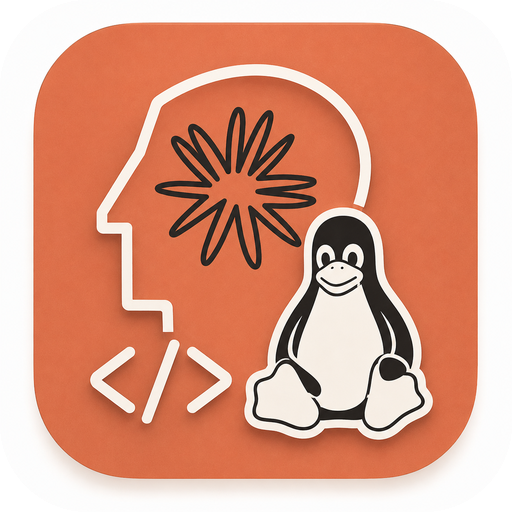
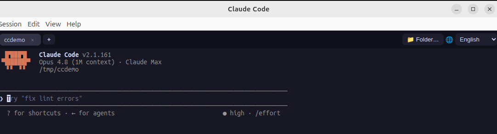
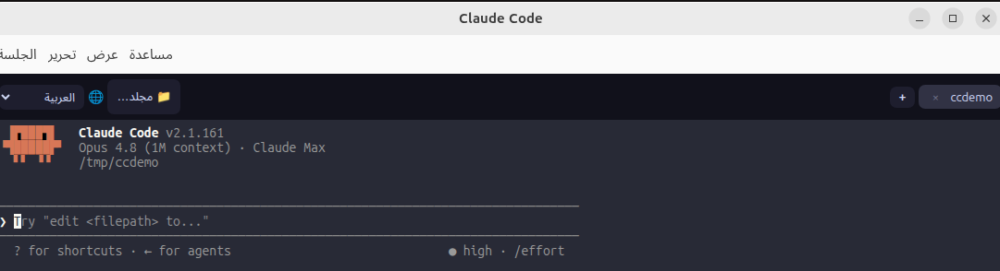
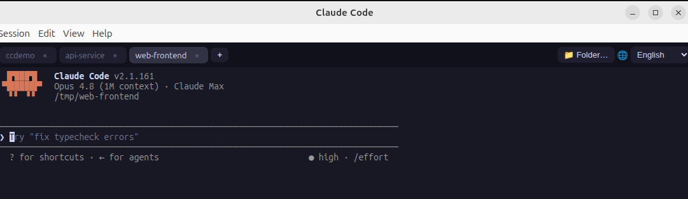
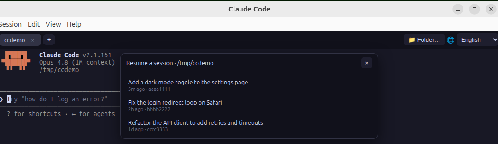

# Claude Code Desktop (unofficial)

A Linux desktop GUI that runs the **real `claude` CLI** inside a window. Not a
reimplementation — it embeds a real terminal (xterm.js + node-pty) and spawns
your installed `claude` binary, so every feature works exactly like the command
line: slash commands, MCP, plugins, hooks, skills, permissions — everything.

> The [official Claude Code desktop app](https://code.claude.com/docs/en/desktop)
> ships only for macOS and Windows ("the desktop app is not available on Linux;
> use the CLI"). This is a self-built wrapper to get a real desktop app on Linux.
> Built and tested on **Ubuntu 24.04 (Wayland + GNOME, x86_64)**.

## Screenshots



Fully localized into 12 languages with right-to-left support, plus 5 color
themes (Arabic + Dracula shown):



Run several sessions in parallel as tabs, and reopen past ones from a visual
picker (**Session ▸ Resume Session…**, `Ctrl+Shift+E`):





## Features

- **Real terminal** running the actual `claude` CLI — 100% feature parity
- **Tabbed sessions** — several Claude sessions at once, each in its own folder
- **Folder picker** — start a session in any working directory
- **Resume picker** — visually browse & reopen past Claude sessions for the
  current folder (titles + timestamps), no need to type `claude --resume`
- **Find** in scrollback, **clear terminal**, **restart session**, tab navigation
- **5 color themes** (Catppuccin Mocha, Dracula, Tokyo Night, Solarized Dark,
  GitHub Light) — remembered across restarts
- **12 UI languages** incl. RTL Arabic — auto-detected, remembered
- Fully localized menu bar (Session / Edit / View / Help), zoom, always-on-top,
  fullscreen, about dialog, docs link
- **Terminal-friendly shortcuts**: `Ctrl+C` / `Ctrl+V` / `Ctrl+W` / `Ctrl+A` /
  `Ctrl+R` stay with the shell; app actions use `Ctrl+Shift+…`
- **Mouse copy/paste**: select text to copy it (PRIMARY selection), middle-click
  to paste, or right-click for a Copy / Paste / Select All menu — plus
  `Ctrl+Shift+C` / `Ctrl+Shift+V`
- Ships as **AppImage** and **.deb**

## Requirements

- Linux with a desktop (tested: Ubuntu 24.04, Wayland + GNOME)
- [Claude Code CLI](https://code.claude.com/docs) installed (`claude` on `PATH`
  or under nvm)
- To build from source: Node.js 18+ and a C/C++ toolchain (for `node-pty`)

## Run from source

```bash
npm install
npm start          # or: ./run.sh
```

Add a desktop launcher (app grid / dock entry, no sudo):

```bash
./install-launcher.sh
```

## Build a packaged app

```bash
npm run dist
```

Produces in `dist/` (x64 Linux):

| File | Use |
|------|-----|
| `claude-code-desktop-<ver>.AppImage` | Portable, no install. Needs **FUSE** (see below). |
| `claude-code-desktop_<ver>_amd64.deb` | `sudo apt install ./dist/claude-code-desktop_*_amd64.deb` — adds an app-menu entry + icon. **No FUSE needed.** |

`npm run dist` also runs `scripts/fix-appimage.sh`, which patches the AppImage's
internal `AppRun` to launch with `--no-sandbox` and `--class=claude-code-desktop`
so it **starts** and **shows the app icon** on Ubuntu 24.04.

> **AppImage & FUSE.** A type-2 AppImage self-mounts via libfuse2, which Ubuntu
> 24.04 does **not** ship (it has libfuse3). Without it a double-click fails with
> *"AppImages require FUSE to run."* Fixes, pick one:
> - `sudo apt install libfuse2t64` (then double-click works), **or**
> - run it FUSE-free: `APPIMAGE_EXTRACT_AND_RUN=1 ./claude-code-desktop-<ver>.AppImage`
>   (the self-installed launcher does this for you after the first run), **or**
> - just use the **`.deb`** (or run from source) — neither needs FUSE.

## How it works

```
Electron (main.js) ──spawn──▶ node-pty ──▶ /path/to/claude
        │                                       │
        └─ preload.js (secure IPC) ─ renderer (xterm.js terminal)
```

- `main.js` — Electron main process: window, localized menu, pty management, settings
- `preload.js` — `contextBridge` IPC surface (the renderer never touches Node directly)
- `renderer/` — xterm.js terminal UI, tabs, themes, find bar, language picker
- `i18n.js` — UI string catalog for the 12 locales

The `claude` binary is resolved robustly even when launched from the app grid
(where `PATH` is minimal): `$CLAUDE_DESKTOP_BIN` → login-shell `command -v claude`
→ newest `~/.nvm/versions/node/*/bin/claude` → common global paths. Override with:

```bash
CLAUDE_DESKTOP_BIN=/path/to/claude ./run.sh
```

## UI language

Pick from the 🌐 toolbar dropdown: English · 简体中文 · 繁體中文 · 日本語 · 한국어
· Español · Français · Deutsch · Português · Русский · العربية (RTL) · हिन्दी.
Auto-detected from your system locale on first launch and saved to
`<userData>/config.json`. Only the **app shell** (menus, buttons, status bar,
dialogs) is translated — terminal content comes from the real `claude` CLI. Add a
locale in `i18n.js`.

## Notes

- **`--no-sandbox`** — on Ubuntu 24.04 the bundled `chrome-sandbox` isn't
  setuid-root and unprivileged user namespaces are restricted by AppArmor, so
  Chromium's sandbox can't start. As a local app launching a local CLI, it runs
  with `--no-sandbox`. To keep the sandbox (needs sudo):
  ```bash
  sudo chown root node_modules/electron/dist/chrome-sandbox
  sudo chmod 4755 node_modules/electron/dist/chrome-sandbox
  CLAUDE_DESKTOP_FLAGS="" ./run.sh
  ```
- **node-pty** is a native module compiled against Electron's ABI. After changing
  the Electron version: `npm run rebuild`.
- **App icon** — a ChatGPT-generated design (line-art Claude head + sunburst, the
  Tux penguin, a `</>` mark). An alternative generator (`assets/icon_gen.py`, by
  the local `gemini` CLI) renders one with
  `python3 assets/icon_gen.py assets/app-icon.png`.
- **AppImage self-integration** — on first launch the AppImage installs its own
  `.desktop` entry and icon into `~/.local/share`, so it gets an app-grid entry
  and a dock/overview icon on any machine, with no AppImageLauncher needed. (The
  `.deb` installs its icon system-wide instead.)

## Uninstall

```bash
# launcher installed from source
rm -f ~/.local/share/applications/claude-code-desktop.desktop
# the .deb
sudo apt remove claude-code-desktop
```

## Limitations

- A thin wrapper, **not** the official app — the UI is the terminal TUI (which is
  exactly what guarantees full feature parity); there is no custom chat / editor /
  diff UI.
- x64 Linux only; tested on Ubuntu 24.04 / Wayland + GNOME. Other distros likely
  work but are untested. ARM64 is not built by default.

## License

[MIT](LICENSE)
